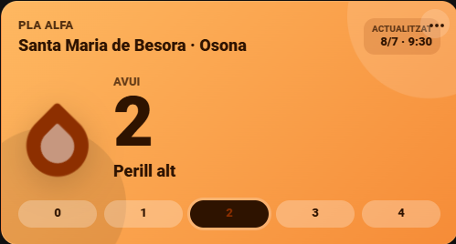

# Risc Incendis Card

Custom Lovelace dashboard card for Home Assistant that displays the official
**Pla Alfa** wildfire risk level from the `risc_incendis` integration.



## Required Integration

Install and configure the sensor integration first:

```text
https://github.com/plleopart/ha-risc-incendis
```

Use that repository as a HACS **Integration** custom repository. This card only
renders the entities created by that integration.

## Installation With HACS

1. Go to **HACS > Dashboard**.
2. Open **Custom repositories**.
3. Add this repository:

```text
https://github.com/plleopart/ha-risc-incendis-card
```

4. Select category **Dashboard**.
5. Install **Risc Incendis Card**.
6. Add the resource if HACS does not do it automatically:

```yaml
url: /hacsfiles/ha-risc-incendis-card/risc-incendis-card.js
type: module
```

## Basic Usage

```yaml
type: custom:risc-incendis-card
entity: sensor.pla_alfa_avui
tomorrow_entity: sensor.pla_alfa_dema
title: Pla Alfa
```

If Home Assistant generated municipality-prefixed entity IDs, use those instead:

```yaml
type: custom:risc-incendis-card
entity: sensor.santa_maria_de_besora_pla_alfa_avui
tomorrow_entity: sensor.santa_maria_de_besora_pla_alfa_dema
title: Pla Alfa
```

## Compact Variant

```yaml
type: custom:risc-incendis-card
entity: sensor.pla_alfa_avui
tomorrow_entity: sensor.pla_alfa_dema
title: Pla Alfa
variant: compact
```

## Options

| Option | Required | Default | Description |
| --- | --- | --- | --- |
| `entity` | yes | none | Sensor with today's Pla Alfa level. |
| `tomorrow_entity` | no | none | Sensor with tomorrow's Pla Alfa level. |
| `title` | no | `Pla Alfa` | Card title. |
| `variant` | no | `default` | Layout variant. Use `default` or `compact`. |
| `animations` | no | `true` | Enable subtle background and flame animations. |
| `show_tomorrow` | no | `true` | Show tomorrow preview. |
| `show_update` | no | `true` | Show source update timestamp. |
| `compact` | no | `false` | Legacy shortcut for `variant: compact`. |
| `show_source` | no | deprecated | Legacy alias. `false` hides the update timestamp if `show_update` is not set. |

## Visual Levels

| Level | Description | Visual treatment |
| --- | --- | --- |
| `0` | Low risk | white / green |
| `1` | Moderate risk | yellow |
| `2` | High risk | orange |
| `3` | Very high risk | red |
| `4` | Extreme risk | dark red |
| `unknown` | No official data | gray |

## Motion

Animations are enabled by default and are intentionally subtle:

- slow background movement
- soft light/shadow drift
- gentle flame breathing
- stronger motion for higher levels

The card respects `prefers-reduced-motion`; animations are disabled when the
browser or operating system requests reduced motion.

Disable animations manually:

```yaml
type: custom:risc-incendis-card
entity: sensor.pla_alfa_avui
animations: false
```

## Development

During development, the card can be served from Home Assistant's `/config/www`
directory:

```text
/config/www/risc-incendis-card/risc-incendis-card.js
```

Resource URL:

```yaml
url: /local/risc-incendis-card/risc-incendis-card.js
type: module
```

When testing local changes, clear the browser cache or add a query string:

```yaml
url: /local/risc-incendis-card/risc-incendis-card.js?v=dev1
type: module
```
